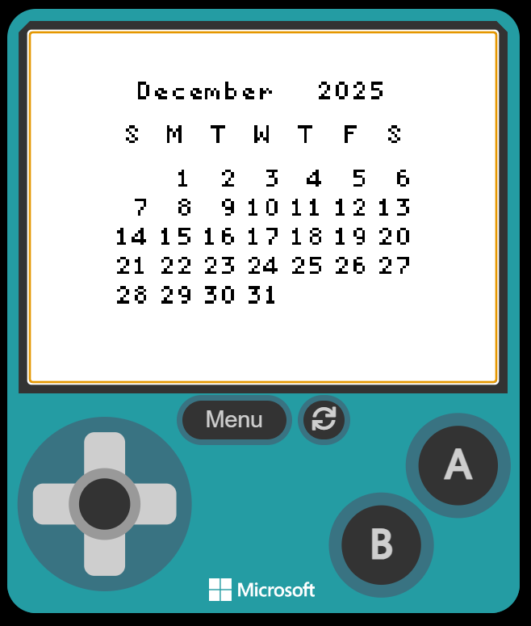
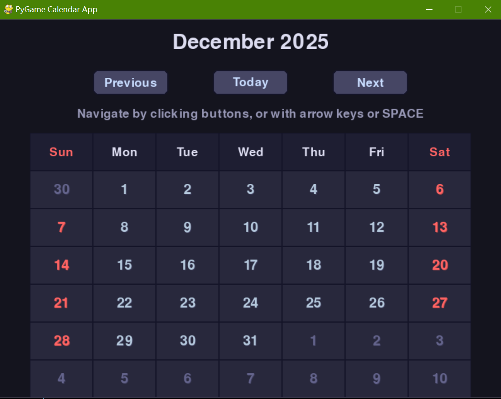

# Calendar App for MakeCode Arcade and PyGame

- **MakeCode Arcade Edition**:


- **PyGame Edition**:


## Overview
This project is a dedicated re-creation of the calendar app, targeting both MakeCode Arcade and PyGame. Although these two frameworks are primarily designed for game development, they are also excellent choices for GUI applications. 

The app's core functionality remains consistent across both platforms, offering a simple and intuitive user interface that allows users to view and navigate through months and years effortlessly.

### Key Features
- **Month and Year Navigation**: Seamlessly move between different months and years using buttons or keyboard shortcuts.
  - Note: In PyGame edition, use the "up" and "down" keys on keyboard to navigate through years.
- **Today's Date Highlighting**: Easily identify the current date on the calendar (PyGame edition only).
- **Year Range Validation**: Ensures the calendar stays within the range from 1970 to 9999.

## Running the App
``` bash
git clone https://github.com/Pac-Dessert1436/Calendar-App-MakeCode-PyGame.git
cd Calendar-App-MakeCode-PyGame
```
1. For the MakeCode Arcade edition (VS Code required):
  - Install and enable the "Microsoft MakeCode Arcade" extension in VS Code.
  - Open the project folder via VS Code. Ensure that the current workspace is exactly this project folder.
  - Navigate to "Asset Explorer" by clicking the MakeCode icon on the VS Code sidebar.
  - Restore project dependencies before running the project, especially by choosing the "Install Project Dependencies" option.
  - With everything prepared, you could either start the MakeCode simulator or create the MakeCode share link.
2. For the PyGame edition:
  - Ensure you have these prerequisites installed:
    - Python 3.10+ (for "match-case" statements in the code)
    - PyGame library (`pip install pygame`)
  - Run the Python script:
  ``` bash
  python calendar_app.py
  ```

## Personal Motivation
As the end of July approaches, I find myself reflecting on the journey of creating this calendar app. The app was born in January 2024, a time when I was full of enthusiasm for programming. Now, I'm in a crossroads of my life, on the verge of retaking the Postgraduate Entrance Exam in my home city.

Even though I'm passionate about programming, I've realized that life is full of choices. I'm currently torn between sticking to Biology and Medicine and pursuing a TCM-related discipline. Preparing for the exam is no easy feat; it's a path filled with self-doubt and a constant need to build confidence. I'm acutely aware of the areas where I need to improve, especially my laboratory skills.

This project has been a fun and rewarding experience. It's a testament to my creativity and determination. However, as I focus on my studies, I've decided to take a break from GitHub until I complete the exam. Life is short, and I need to channel my energy into this important step forward.

## License
This project is licensed under the MIT License. See the [LICENSE](LICENSE) file for details.